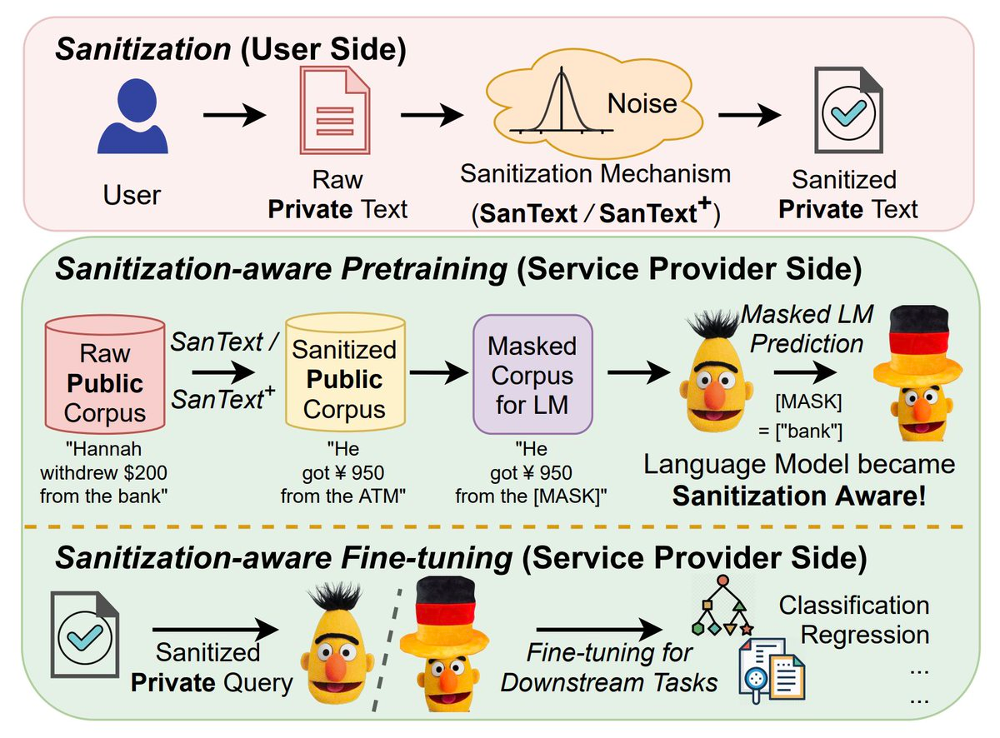

## Run a Single Sentence Sanitization Example

You can quickly test the SanText and SanText+ algorithms on a single sentence using the provided script:

### 1. Install Dependencies
Make sure you have installed the required packages:
```sh
cd SanText
pip install -r requirements.txt
```

### 2. Prepare Data
Ensure the following files are present in the `SanText/data/` directory:
- `glove.840B.300d.txt` (GloVe embeddings, ~5.3GB)
- `SST-2/train.tsv` and `SST-2/dev.tsv` (SST-2 dataset)

If these files are missing, run:
```sh
./download.sh
```
This will download and extract the required datasets. For GloVe, download from [GloVe website](https://nlp.stanford.edu/projects/glove/) if not present.

### 3. Run the Script
Run the following command to execute the example:
```sh
python sanitize_one_sentence.py
```
This will print the original sentences and the outputs of both SanText and SanText+ sanitization methods, along with the time taken for each method.

To test different sentences, edit the `example_sentences` variable in `sanitize_one_sentence.py`.

## Efficient Batch Sentence Sanitization

If you want to sanitize many sentences (e.g., a whole dataset), use the `SanTextBatchProcessor` class in `sanitize_one_sentence.py`. This class loads all resources (vocab, embeddings, caches, etc.) only once and can efficiently process sentences in both serial and parallel modes.

### Example Usage: Serial and Parallel Processing

```python
from sanitize_one_sentence import SanTextBatchProcessor

sentences = [
    "The movie was absolutely wonderful and inspiring.",
    "I did not enjoy the film at all.",
    "The plot was predictable but the acting was great."
]

processor = SanTextBatchProcessor()

# Serial processing
results_serial = [processor.sanitize(sent, method="SanText") for sent in sentences]

# Parallel processing
import concurrent.futures
with concurrent.futures.ThreadPoolExecutor() as executor:
    results_parallel = list(executor.map(lambda sent: processor.sanitize(sent, method="SanText"), sentences))

for sent, sanitized in zip(sentences, results_serial):
    print(f"Original: {sent}")
    print(f"Sanitized (serial): {sanitized}\n")

for sent, sanitized in zip(sentences, results_parallel):
    print(f"Original: {sent}")
    print(f"Sanitized (parallel): {sanitized}\n")
```

- You can use `method="SanText+"` for the SanText+ mechanism.
- This approach is much faster than calling the single-sentence function repeatedly.
- For very large datasets, you can further optimize by chunking or using more threads.

## Using the `SanTextBatchProcessor` Programmatically

The `SanTextBatchProcessor` class is the recommended way to sanitize sentences in bulk. It supports both the SanText and SanText+ methods.

### Class Signature
```python
class SanTextBatchProcessor:
    def __init__(self,
        glove_path="data/glove.840B.300d.txt",
        filtered_glove_path="data/glove.filtered.txt",
        data_dir="data/SST-2/",
        epsilon=15.0,
        p=0.2,
        sensitive_word_percentage=0.5,
        vocab_cache_path="vocab_cache.pkl",
        glove_cache_path="glove_filtered_cache.pkl"
    ):
        ...
    def sanitize(self, sentence, method="SanText"):
        ...
```

### Parameters
- `sentence` (str): The input sentence to sanitize.
- `method` (str): Which sanitization method to use. Must be either `'SanText'` or `'SanText+'`. Default is `'SanText'`.
- The other parameters are the same as before and control resource paths and privacy settings.

### Example: Sanitize a Single Sentence
```python
from sanitize_one_sentence import SanTextBatchProcessor

processor = SanTextBatchProcessor()
sentence = "The movie was absolutely wonderful and inspiring."
sanitized = processor.sanitize(sentence, method="SanText")
print("SanText output:", sanitized)
```

**For best performance on datasets, always use the batch processor class and parallelization as shown above.**

--------------------------------------------------------------------------------------------
# SanText
Code for Findings of ACL-IJCNLP 2021 **"[Differential Privacy for Text Analytics via Natural Text Sanitization](https://arxiv.org/pdf/2106.01221.pdf)"**

Please kindly cite the paper if you use the code or any resources in this repo:
```bib
@inproceedings{ACL21/YueDu21,
  author    = {Xiang Yue and Minxin Du and Tianhao Wang and Yaliang Li and Huan Sun and Sherman S. M. Chow},
  title     = {Differential Privacy for Text Analytics via Natural Text Sanitization},
  booktitle = {Findings, {ACL-IJCNLP} 2021},
  year      = {2021},
  }
```
**The first two authors contributed equally to this work.**

## Introduction
The privacy issue is often overlooked in NLP. 
We address privacy from the root: 
directly producing sanitized text documents based on differential privacy.
We further propose sanitization-aware pretraining and finetuning to adapt the currently dominating LM (e.g., BERT) over sanitized texts. It "prepares" the model to work with sanitized texts, which leads to an increase in accuracy while additionally ensuring privacy.

<p align="center">

</p>


## Setup Environment
### Install required packages
```shell
git clone https://github.com/xiangyue9607/SanText.git
cd SanText
pip install -r requirements.txt
```
### Download the experimental data
We used three datasets in our paper: SST2, QNLI and CliniSTS. SST2 and QNLI 
are from [GLUE benchmark](https://gluebenchmark.com/tasks) and they are public available.
CliniSTS is not public available. Contact their [paper](https://arxiv.org/abs/1808.09397) authors for more details to access the data.
```shell
./download.sh
```


## Sanitize the text inputs
We propose two sanitized mechanisms based on differential privacy: **SanText** and **SanText+**.
Here we show some examples for running these algorithms:
```shell
 python run_SanText.py \
  --task SST-2 \
  --method SanText \
  --epsilon 3.0 \
  --word_embedding_path ./data/glove.840B.300d.txt \
  --word_embedding_size 300 \
  --data_dir ./data/SST-2/ \
  --output_dir ./output_SanText_glove/SST-2/ \
  --threads 8 
```

```shell
 python run_SanText.py \
  --task SST-2 \
  --method SanText \
  --embedding_type bert \
  --epsilon 14.0 \
  --data_dir ./data/SST-2/ \
  --output_dir ./output_SanText_bert/SST-2/ \
  --threads 8 
```

```shell
  python run_SanText.py \
  --task QNLI \
  --method SanText_plus \
  --epsilon 1.0 \
  --word_embedding_path ./data/glove.840B.300d.txt \
  --word_embedding_size 300 \
  --data_dir ./data/QNLI/ \
  --output_dir ./output_SanText_plus_glove/QNLI/ \
  --threads 12 \
  --p 0.3 \
  --sensitive_word_percentage 0.9 
```


## Finetune sanitization-aware BERT models
We then show examples how to finetune BERT models to do NLP tasks based on these sanitized texts in the previous step.
  
```shell
python run_glue.py \
  --model_name_or_path bert-base-uncased \
  --task_name sst-2 \
  --do_train \
  --do_eval \
  --data_dir ./output_SanText_glove/SST-2/eps_3.00/ \
  --max_seq_length 128 \
  --per_device_train_batch_size 64 \
  --per_device_eval_batch_size 64 \
  --learning_rate 2e-5 \
  --num_train_epochs 3.0 \
  --output_dir ./tmp/sst2-sanitize/ \
  --overwrite_output_dir \
  --overwrite_cache \
  --save_steps 2000
```

```shell
python run_glue.py \
  --model_name_or_path bert-base-uncased \
  --task_name qnli \
  --do_train \
  --do_eval \
  --data_dir ./output_SanText_plus_glove/QNLI/eps_1.00/sword_0.90_p_0.30 \
  --max_seq_length 128 \
  --per_device_train_batch_size 64 \
  --per_device_eval_batch_size 64 \
  --learning_rate 2e-5 \
  --num_train_epochs 2.0 \
  --output_dir ./tmp/qnli-sanitize/ \
  --overwrite_output_dir \
  --overwrite_cache \
  --save_steps 2000
```

## Pretrain sanitization-aware BERT models (optional)
We finally show how to pretrain sanitization-aware BERT models based on the public corpus such as Wikipedia.
Note that this step training is often time-consuming and costly. We denote this step as optional, however,
sanitization-aware pretrain can improve the model's performance in the downstream tasks while not hurting the privacy.

Here we give an example based on a very small subset of the Wikipedia ([WikiText-2](https://www.salesforce.com/products/einstein/ai-research/the-wikitext-dependency-language-modeling-dataset/)). 

```shell
python run_language_modeling.py \
--output_dir ./tmp/pretraining_bert_eps12_wiki2/ \
--model_type bert \
--model_name_or_path bert-base-uncased \
--do_train \
--train_data_file ./data/wikitext-2/wiki.train.tokens \
--do_eval \
--eval_data_file ./data/wikitext-2/wiki.valid.tokens \
--mlm \
--per_device_train_batch_size 8 \
--per_device_eval_batch_size 8 \
--logging_steps 500 \
--save_steps 5000 \
--overwrite_output_dir \
--epsilon 12.0 \
--num_train_epochs 1.0 \
--warmup_steps 3000 \
--threads 24
```


You can use your own training data to replace the example data. 
We also hardcode the full Wikipedia data (by loading from the [Huggingface Wikipedia dataset](https://huggingface.co/datasets/wikipedia))
If you want to enable the full wiki pretraining, you can run the following (i.e., let ```train_data_file = Wikipedia```):
```shell
python run_language_modeling.py \
--output_dir ./tmp/pretraining_bert_eps12_wiki_all/ \
--model_type bert \
--model_name_or_path bert-base-uncased \
--do_train \
--train_data_file Wikipedia \
--do_eval \
--eval_data_file ./data/wikitext-2/wiki.valid.tokens \
--mlm \
--per_device_train_batch_size 8 \
--per_device_eval_batch_size 8 \
--logging_steps 500 \
--save_steps 5000 \
--overwrite_output_dir \
--epsilon 12.0 \
--num_train_epochs 1.0 \
--warmup_steps 3000 \
--threads 24
```

Note that if you enable full wiki training, it will be really time-consuming. 
The data preprocessing often takes more than 10 hours. We released our pretrained models 